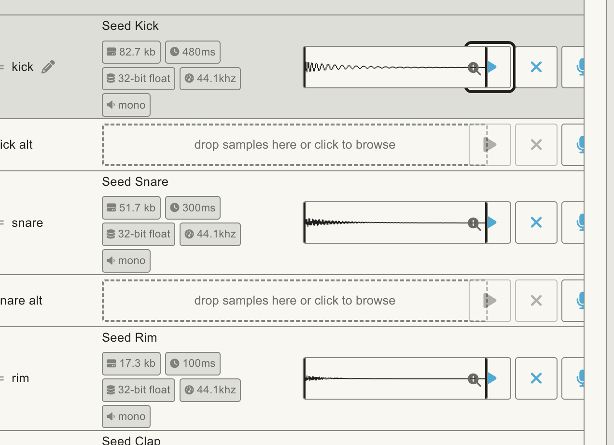

# Human verification issues

## HV-001 — Drum Table boxes overlap actions and rightmost controls are clipped

- Status: OPEN; requires repair and human retest.
- Reported: 2026-09-29, guided Round 1, using Human Test 01 / Studio Seed.
- Priority: Medium — visible layout defect affecting the presentation of row controls.
- User report: “confirmed however we need to record this issue with the table. The boxes are cutoff”.
- Evidence: [original screenshot](evidence/human-table-clipped-2026-09-29.png).
- Observed: loaded-row waveform boxes and empty-row drop zones extend into the Play-button area; the rightmost row controls are clipped at the visible table boundary. The screenshot establishes the visible defect, not its CSS cause.
- Reproduction starting point: load the Studio Seed kit, select Table, inspect loaded kick/snare/rim rows and neighboring empty rows. Exact browser/version, viewport and zoom were not reported and remain to be captured during reproduction.
- Expected: waveform/drop areas fit their cells; action buttons and focus outlines are visible and do not overlap those areas. Any horizontal scrolling needed must be discoverable and allow access to every action.
- Functional result: the user separately confirmed Table/Focus switching preserves the kick and its settings. That check PASSED; layout is FAILED.
- Retest: reproduce at the reported window size/zoom, fix the layout, check loaded and empty rows at nearby widths, add a geometry regression, and have the user confirm the original clipping is gone.
- Scope of this update: evidence and issue recording only; no application code or visual baseline changes.

## HV-002 — Exported kick gain differs from the earlier test target

- Status: RESOLVED — exported gain matches the user’s chosen current value.
- Observed: 2026-10-01, attached Human Test 01 export, Seed Kick.wav region `gain: -8`. Earlier guided checks used KD1 −6 dB.
- Source trace: patchGeneration.ts writes `gain: sample.gain` directly; its existing test expects input −6 to export −6. No scaling conversion in that path explains the difference.
- Resolution, 2026-10-01: user confirmed “-8 which is what I set it to”. The current UI and exported region both have −8 dB. There is no demonstrated export mismatch; the prior −6 dB instruction is historical and does not override the user’s chosen value.
- Evidence: [export report](evidence/human-export-2026-10-01-summary.json), [preserved patch.json](evidence/human-export-2026-10-01-patch.json).
- Result: gain preservation PASSED at −8 dB. No application repair is required for this finding.

## HV-003 — OP-XY playback reported very quiet; user increased gain

- Status: RECORDED, NONBLOCKING OBSERVATION — kick-only sample-gain concern; no software defect demonstrated. Numeric readback is unavailable through the reported slider-only screen.
- Reported: 2026-10-01, Human Test 01, OP-XY firmware 1.1.25; local Mac macOS 26.1.
- User report: “It worked. It was very quiet and I had to turn up the gain”.
- Context: after successful import, full sparse-kit key mapping/playback and restart, the user was asked to inspect kick sample gain without rotating the encoder. The attached export has kick gain −8; other regions have gain 0.
- Clarification: user reported “only the kick was quiet. I used the sample gain to increase”. The quietness and adjustment were specific to the kick, not whole-kit or master/track volume.
- Display limitation: user reports “OPXY does not show a number , only a slider”. The coordinator’s numeric-readout instruction was inappropriate for this reported screen. Do not request the same number again.
- Not verified: original/current numeric hardware gain, listening output and master/track levels. Do not infer a numeric match or export mismatch.
- Fixture state: the user reports changing hardware gain. Subsequent listening must not be treated as an unchanged exported fixture. Preserve that adjustment and use a separately identified comparison fixture for any retest.
- Interpretation: kick-only quietness is consistent with the intentionally selected/exported −8 gain versus 0 on the other regions. This does not establish exact numeric hardware preservation.
- Follow-up result, 2026-10-01: the user answered “yes and yes, it was louder” to the Human Test 01 (kick −8) versus Human Test 02 (kick 0) check on the same hardware track 2 at unchanged listening levels, including successful copy/M4 eject/fresh load and unchanged other nine sounds/mapping. Local inspection had established that only the preset name and kick gain differed and all ten WAVs were byte-identical. Qualitative exported-gain response PASSED; exact numeric hardware gain remains unverified. No application gain repair is indicated by this observation. Preserve the adjusted track 1.
- Existing results: successful import, mapping, normal playback and restart remain valid for the completed checks. HV-002 remains resolved for the app/export match; numeric hardware gain readback is not observable through the reported slider screen and remains unverified.
- Scope: observation recording only. No application code, exported files or hardware state changed by the assistant.

## HV-004 — Safari Overview illustrations overflow launch cards and overlap controls

- Status: OPEN; requires reproduction, repair and human Safari retest.
- Reported: 2026-10-01, while preparing the browser microphone recording test.
- Priority: Medium — launch-card graphics overlap action labels/buttons and extend outside their intended areas.
- User report: “FYI. When I open it in Safari this is what happens”.
- Evidence: [original Safari screenshot](evidence/human-safari-overview-overflow-2026-10-01.png).
- Observed: the four-card Overview is visible. The piano grid, orange sample waveform, six percussion tiles and track-lane artwork extend into the card footers or beyond the cards; Setup guide/Open controls and lower labels overlap the artwork. The External Gear strip obscures the overflowing lower portions.
- Browser/environment: Safari user-reported; exact Safari version, CSS viewport and zoom unknown. The screenshot shows OP-1 FIELD selected, not OP-XY. This selection is a separate setup observation; its causal relationship to the overflow has not been established. macOS 26.1 was previously read on this host.
- Expected: illustrations fit their assigned card area at the browser's current window size/zoom; labels, buttons and adjacent sections do not overlap them.
- Cause: not established. Screenshot evidence alone does not prove a particular CSS/SVG rule, stale asset or Safari-exclusive failure.
- Reproduction/retest: capture Safari version/viewport/zoom; reproduce Overview in the reported OP-1 Field mode and the intended OP-XY mode; examine actual diagram/card dimensions; verify all four cards at the failing and nearby widths. Any repair needs geometry regression coverage and a real Safari retest.
- Test impact: Overview presentation FAILED for this screenshot. The microphone capture/review test still has no reported result; earlier transfer/listening results remain valid.
- Scope: preserve evidence and record the defect. Application code, visual baselines and browser data were not changed.
- Preserved screenshot: 3240 × 2222 image pixels (not a measured CSS viewport); SHA-256 `a9455b6b6fc0f4cf2a021a735d189e7ca57f643035119344b0a0a174d887d107`.

## HV-005 — Enable input fails on the built-in microphone; Start hides the original error

- Status: RESOLVED for the reproduced setup error — real Chrome input enable verified; user confirmed manual recording/stop and very clear audition on 2026-10-01. User also confirmed application to Pad 4, same phrase playback and 11 / 24 loaded. User also confirmed library save and preset download; export structure passed local inspection. User confirmed Human Test 03 loads without error and plays the voice clearly on OP-XY (“works perfectly”). The bounded manual round trip passes; other recording scenarios remain untested.
- Reported: 2026-10-01 during Human Test 02, empty Pad 4 / SD2 → Focus → Record here → MacBook Pro Microphone (Built-in) → Manual → Enable input.
- User observed: “State: error. Level 0%. Take time 0.00 s.” Start recording then said to enable input. Assistant reproduced the original processor error in the user's Chrome tab: `Capture channel dimensions changed`.
- Cause: the processor allocated its capture core from the track's reported channel count before receiving audio. The delivered channel layout differed, triggering the dimension guard. Starting after failed setup replaced that error with “Enable input before recording”. The user's sequence was correct.
- Repair: establish mono/stereo format from the first delivered block, preserving pending Start/Arm. Reject later format changes and make fatal processor failures terminal. Reserve stereo capacity and recheck the actual context sample rate before worklet allocation. Await queued startup messages before returning success. Failed modal setup preserves the original error, unlocks setup controls, and disables Start/Arm until a successful retry.
- Regression evidence: [initial channel failures](evidence/hv005-channel-red.log), [initial UI failures](evidence/hv005-ui-red.log), [review follow-up failures](evidence/hv005-review-red.log). Tests cover both reported/delivered mismatch directions, literal stereo PCM through the processor and session, Arm before first delivered audio, later channel changes in both directions, unsupported layouts, no-input terminal behavior, capacity, queued startup failures and retry UI.
- Final automated checks: [project gate](evidence/hv005-final-check.log) PASS — typecheck, lint, 1,136 tests / 111 files, build and PWA verification. [Production recording workflows](evidence/hv005-browser-check.log) PASS — all five configured Chromium cases, using only the explicit deterministic fake audio device on isolated port 5187; no actual microphone recording.
- Independent review: Genspark Sol 5.6 read-only [initial review](evidence/hv005-genspark-initial-review.txt) found three related defects; each reproduced with failing tests and repaired. [Follow-up review](evidence/hv005-genspark-followup-review.txt) found no remaining material issues in the scoped diff. [Scoped diff against preserved WIP](evidence/hv005-review.diff).
- Real-browser outcome: after the development reload, the saved kit was restored through its normal Restore action and verified as Human Test 02, 10 / 24 loaded. Selected empty Pad 4 / SD2, opened Record here, chose the named built-in microphone, enabled input. Chrome visibly reported `State: monitoring. 48000 Hz, 2 channels`, with no error. Level was 0% in the status read and 1% in the subsequent screenshot; a small input signal is present, but speech response, captured audio and audition are not yet verified. [Monitoring screenshot](evidence/hv005-chrome-input-monitoring.jpg).
- Human retest result, 2026-10-01: user answered “yes, very clearly” to hearing the phrase after the guided Start recording → speak → Stop recording → Audition sequence. Capture/stop/review playback PASS by user report; no assistant claim of independently hearing the voice or verifying speech-triggered mode.
- Pad application result, 2026-10-01: user answered “yes!” to the same phrase playing via Play selected on Pad 4 after Add selected takes, and 11 / 24 loaded. Application/playback PASS by user report.
- Save/export result, 2026-10-01: user confirmed library save and Human Test 03.preset.zip download. Local [inspection](evidence/human-export-2026-10-01-03-summary.json) verifies 11 mapped samples, Take 1.wav at Pad 4 / MIDI 56, nonzero PCM16 mono 44.1 kHz audio, 249548 frames / 5.659 s and valid trim. All ten original WAV bytes and regions match Human Test 02. ZIP was extracted to Downloads/Human Test 03.preset and extracted bytes verified; no earlier export overwritten.
- Hardware result, 2026-10-01: user answered “works perfectly” to whether Human Test 03 loads without error and plays the recorded phrase clearly on OP-XY. Import/recorded-source playback PASS by user report. Instructions used the existing presets/PatchStudio Tests category and test track 2; exact hardware state was not independently read. This does not verify new-fixture restart persistence, exact physical voice-key position, every recording mode or all hardware formats/settings.
- Next: this bounded manual recording round trip is complete. Keep other recording scenarios and broader hardware fixtures pending; HV-001/HV-004 remain deferred open defects.
- Boundaries: the user recorded the test voice locally; the assistant did not capture voice or replace kit sounds. The assistant read the local export for structural inspection and prepared its matching extracted folder; no voice sent to an external reviewer or service. No hardware operation, commit, push, dependency installation, deployment or visual baseline changes. HV-001 and HV-004 remain OPEN.

## HV-006 — Slicing count control and drag affordance are unclear

- Status: RECORDED UX OBSERVATION; no direct desired-count field exists in the current slicer. Automatic detection failure is not established; manual control exists under Advanced. No application code changed.
- Reported: 2026-10-02, guided Human Test 04 using recorded Take 1.opfloat. User: “it chopped my voice into 17 samples but I dont see a location to chose the number of samples. Also, Can I drag the boxes representing the section of the sample chop to a key?”
- Live Chrome: “Turn a loop into drum sounds”, Take 1.opfloat / 5.66 seconds, Sound 15 of 17, zero assigned and 17 unassigned. Pads 2 / KD2 and 7 / TB are empty; Pad 4 still contains the source. Browser draft left unchanged.
- Source: SliceAudioModal automatically runs analyzeSlices. Advanced offers Detection sensitivity, Minimum spacing, Detect sounds again, Reset to full source, Split sound, Add sound and Delete sound; there is no numeric desired-slice-count control. Reset creates one full-source sound; Split sound divides the selected sound at its midpoint.
- Drag behavior: numbered sound buttons carry the slice ID through dragstart; SliceKeyboardMapping destination keys accept that drop. The waveform canvases are for display/boundary editing, not drag-to-pad assignment. Dropping on an occupied pad stages a replacement confirmation; avoid occupied pads for this guided check. Human drag/drop behavior has not yet been verified.
- Guided next step: Advanced → Reset to full source → Replace edits if prompted → Split sound; expect exactly two sounds. Later drag numbered sound 1 to empty Pad 2 / KD2 and sound 2 to empty Pad 7 / TB; verify staged assignments before Add sounds to kit. Preserve the original Pad 4 source and saved/exported Human Test 03.
- Scope: recorded observation and verified current controls; no source changes, deferred visual changes, commit/push/install or hardware action.

### HV-006 follow-up — control grouping and pending reset, 2026-10-02

- User reports Advanced does not look like a button, controls need clearer grouping, and the instruction to scroll inside the white panel was unclear. That instruction meant scrolling while the pointer is over the slicer dialog, but it did not identify an obvious scroll area.
- Live Chrome now shows Sound 16 of 18, zero assignments and a pending reset confirmation (Replace edits / Keep edits). Split sound remains enabled while that confirmation is pending. The two-sound preparation has not passed; the source and current draft remain intact.
- OPEN usability/state-safety finding: confirmation is separated from its trigger and does not block competing draft mutations. No detector malfunction is established.
- Evidence: [current untouched draft](evidence/hv006-current-slicer-draft.png), [read-only Genspark assessment](evidence/hv006-genspark-ux-review.txt). The user's original screenshot is preserved if its temporary attachment is still available.
- Candidate bounded design, NOT YET APPROVED: Make slices (source, detection/reset and obvious Detection settings disclosure); Edit and listen (numbered sounds, waveform, audition, split/delete, Detailed timing disclosure); Assign to keys (keyboard, destination, assignment and replacement approval). Keep Cancel / Add sounds to kit visible in a fixed footer; only the body scrolls. Put destructive confirmations beside their triggers and block competing mutations while pending. Preserve Keep edits exactly and all existing source/occupied-pad guards.
- Human Test 04 paused for this design decision. No source, tests, browser state, visual baseline, saved fixture or hardware changes. Do not hot reload or remount the current unsaved draft during future implementation without a preservation plan.

### HV-006 approved repair — 2026-10-02

- Status: IMPLEMENTED; automated verification PASS; human usability acceptance remains pending. User approved the bounded three-group design and authorized independent computer-based checks, recording feedback and carrying review principles forward across the project.
- Implemented Make slices / Edit and listen / Assign to keys; recognizable bordered native disclosures; only the body scrolls while Cancel / Add sounds to kit remain visible. Reset/reanalysis decisions now block competing edits, DnD/assignments, M shortcut and Apply. Keep edits retains the draft.
- Browser testing exposed excessive drag distance between numbered selection and keys; a selected-sound drag control beside destination keys resolves the tested workflow. Numbered selection and non-drag assignment remain available.
- Source snapshot retained across compatible effect refreshes; explicit close clears it so a later opening initializes a new draft. Existing atomic commit, source-pad and occupied-pad replacement protections remain.
- Evidence: [verification summary](evidence/hv006-slicer-verification-summary.json), [ready live screenshot](evidence/hv006-approved-slicer-ready.png), [Genspark review](evidence/hv006-genspark-implementation-review.txt). Original RED, drag and shortcut mutation RED logs retained with GREEN and integrated checks.
- Checks: npm run check PASS, 1,143 tests / 111 files; 31 focused slicer tests; production slicing suite 20 PASS across all five configured profiles, including keyboard, native drag/drop, export/Undo and desktop/phone footer geometry. No pixel baselines changed. Read-only Genspark review: no blocking runtime defects; low findings dispositioned in the summary.
- Live preservation: 18 sounds, selected Sound 16, Start 3.197 s / End 3.208 s, zero assigned, original Take 1.opfloat unchanged on Pad 4. The reset decision survived refresh; assistant then clicked Keep edits to retain the draft and unlock controls. No Reset/Apply/export/audio/hardware action on the user's draft.
- Carry-forward rules: docs/design-system/studio-usability-feedback.md. Fully computer-based checks are agent-owned in isolated fixtures; human listening, physical hardware and subjective usability remain separate. No guarantee that future regressions are impossible.
- No desired-count selector added; detector failure still not established. HV-001/HV-004 stay OPEN and deferred. No commit/push/deploy/install or unrelated design changes.

## HV-007 — Occupied pads cannot be replaced/unassigned; sound selection is separated from waveform

- Reported: 2026-10-02, Human Test04 recorded voice. User reports empty-pad drag works, occupied/pre-existing sound replacement and removal do not; numbered selectors are too far up and an extra assignment step feels unnecessary.
- Cause: application explicitly prohibited replacing the source pad; Unassign operated only on current slice mappings. Number selectors preceded the editing waveform, and a duplicate drag control was introduced during HV-006 regrouping.
- Status: REPAIRED, automated PASS; human usability/listening acceptance PENDING. Waveform now directly precedes numbered selectors and keys follow. Drop onto any loaded pad requests Replace/Keep and preserves its prior sound. Select a destination key then Unassign pad sound to retain its original in Unassigned sounds. Unassigning a staged replacement first restores the original. All changes remain staged until Add sounds to kit; Cancel leaves the project untouched.
- Safeguards: exact occupied/unassigned/source snapshots, stale approval recovery, atomic application, source identity retention, original PCM/file bytes retained, Undo/Redo, stable confirmation focus and zero-sound Add recovery. Meaningful RED failures preceded fixes.
- Evidence: [summary](evidence/hv007-slicer-verification-summary.json), [scoped diff](evidence/hv007-review.diff), [project gate](evidence/hv007-final-check.log), [five-profile browser checks](evidence/hv007-browser-check.log), [Opus initial](evidence/hv007-opus-review.txt) and [follow-up](evidence/hv007-opus-followup.txt). Final gate:1,154 tests/111 files, type/lint/build/PWA PASS;25 browser tests PASS. Follow-up declares limited self-review, no runtime tests, no remaining material findings.
- Integration incident: provider code change caused a full development reload; the user's unsaved eighteen-sound draft was interrupted. The loss was disclosed. Normal Restore recovered Human Test04 with11 loaded including Pad4 Take1.opfloat, then fresh detection produced17 unassigned sounds. The previous extra split/selected boundaries were NOT recovered. No assistant Apply/replacement/unassignment/export/listening/hardware action on this live fixture.
- Forward lesson: test occupied/source/stale states, keep item selection next to editing and destinations, remove duplicate actions, and verify actual draft persistence before integration. Recorded in studio-usability-feedback.md. HV001/HV004 remain deferred; no general release or hardware approval.
